# Technical Report

**Project: Effect of good Primary Schools on HDB resale prices**  
**Members: Liew Ting Yu, Su Xiangling, Brenda, Woo Ern Xi, Elsie, Yeo Jing En Kelly, Yeo Jing Wen, Cheryl**  
Last updated on 9 April 2026

## Context 
Housing affordability and urban planning are key policy concerns in Singapore. Access to high-quality education is often an important factor influencing residential location choices. 

Singapore's primary school admission system operates across multiple phases (Phase 1 through 2C Supplementary), each with different eligibility criteria. In later phases, home-school distance becomes the key tiebreaker where children within 1km receive the highest priority, followed by 1–2km, then beyond 2km. For competitive schools, balloting may still occur within 1km, making admission significantly less likely for those outside this range.

This creates strong incentives for households to live near preferred schools, which may translate into price premiums in the resale market. This is particularly relevant to the Ministry of National Development (MND), which monitors HDB resale prices to support policy interventions and maintain housing affordability.

## Scope
### 2.1 Problem
Existing housing valuation and forecasting approaches account for locational factors like flat size, building age and proximity to amenities, but do not adequately capture school-related premiums. This omission may reduce forecast precision near sought-after schools and limit the ability to anticipate demand concentration across neighbourhoods. 

As a result, flats near popular schools may be systematically mispriced in valuation models, affecting the effectiveness of housing policy and market monitoring.

This project addresses this gap by quantifying the impact of proximity to “good” primary schools on HDB resale prices, and distinguishing the premium associated with school quality from general proximity to any school. 

### 2.2 Success Criteria
The project is considered successful if it meets the following goals: 

1. Business Goal: Obtained empirical evidence on whether proximity to a “good” school is associated with resale prices. Establishing whether a measurable school premium exists would support more informed housing market analysis and provide useful evidence for housing policy discussions.   
2. Operational Goals: Ensure robust and consistent estimation of the good school premium across different model specifications (OLS, SEM, RDD). Results should be robust across at least two different modelling specifications.  
   1. The fully specified model should achieve an adjusted R² of above 0.85, indicating sufficient explanatory power.   
   2. The model should also effectively distinguish between general school proximity effects and the additional premium associated with “good” schools, with stable and interpretable coefficients.

### 2.3: Assumptions   
We assume the following: 

* The constructed school tiers reasonably reflect perceived differences in school quality among buyers  
* HDB resale prices capitalise all factors valued by buyers, including accessibility and nearby amenities and no information is hidden.  
* Buyers' willingness to pay for school access is capitalised into observed transaction prices, such that the school proximity coefficient reflects the market-implied premium for living near a Good School.

## Methodology
### 3.1 Technical Assumptions

* PCA-derived scores meaningfully summarise key differences in school characteristics and assume linear relationships between variables  
* Distance-based measures are appropriate proxies for accessibility  
* Homebuyers all have the same marginal willingness to pay, while people are likely heterogeneous in their preferences and hence have different MWTPs.

### 3.2 Data & Feature Engineering
**School Data**

This project integrates multiple data sources to capture housing characteristics, school quality and accessibility to amenities. We integrated six data sources from [data.gov.sg](http://data.gov.sg) and [elite.com.sg](http://elite.com.sg). The variables were grouped into four categories: demand, academic prestige, institutional resources, and holistic development. Demand scores were computed as the ratio of applicants to vacancies and averaged across 2022-2025 for each registration phase, using only active ballot phases. Schools with no Phase 2CS ballot were assigned a demand score of 0, as vacancies were likely filled in earlier phases rather than missing at random.  

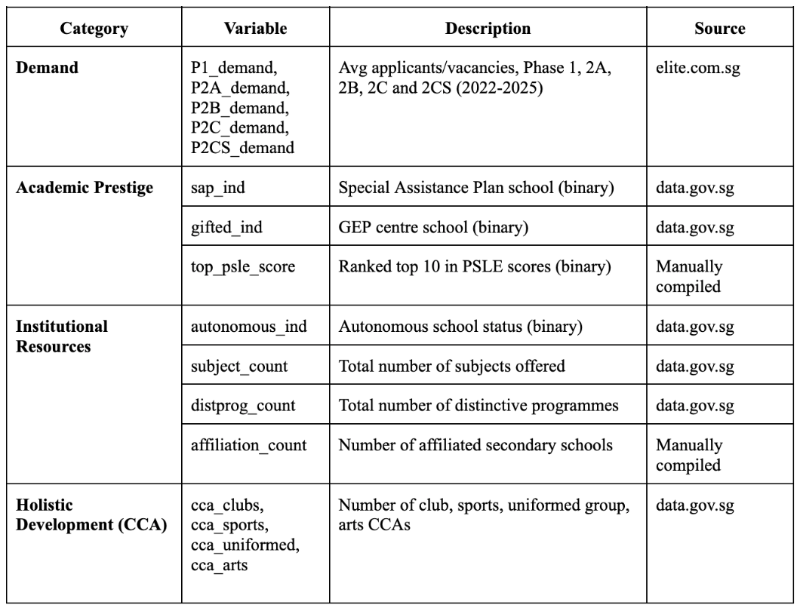

**Defining Good Schools**

We define Good Schools as schools that are both highly sought-after by parents and demonstrate strong academic and institutional characteristics, capturing demand and supply-side quality. All school variables were combined using Principle Component Analysis, preferred over manual weighting to avoid arbitrary weight assignment and address multicollinearity across demand variables.

The first principal component (PC1) explains 35.1% of the total variance and was selected as the composite score as it provides the most interpretable dimension of variation across schools. Its strongest loadings include demand indicators, SAP status, PSLE ranking and gifted status, suggesting that PC1 primarily captures school prestige and parental demand. Variables such as subject count and Phase 2CS demand exhibit negative loadings, as Phase 2CS typically reflects lower-preference schools that still have vacancies in later phases, while a higher subject count may characterise larger or less selective schools rather than academically prestigious ones.   
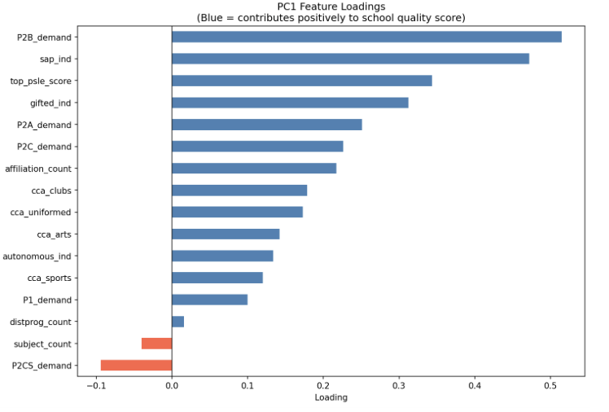

PC1 scores were standardised into z-scores and classified into four tiers. Only Tier 1 schools are defined as Good Schools. 23 out of 182 schools (13%) are classified as Tier 1, recovering widely recognised elite schools and supporting the validity of the framework.

**HDB and Amenity Data**

We integrated HDB resale transactions, MRT Exits, Bus Stops, Hawker Centres datasets from [data.gov.sg](http://data.gov.sg) and shopping malls data from Wikipedia. Walking distance was used for nearest-amenity measures as it better reflects actual accessibility, derived via the OneMap API from each flat's centroid. Euclidean distance was used for density-based features (number of MRTs, bus stops within 500m/1km) for computational efficiency.

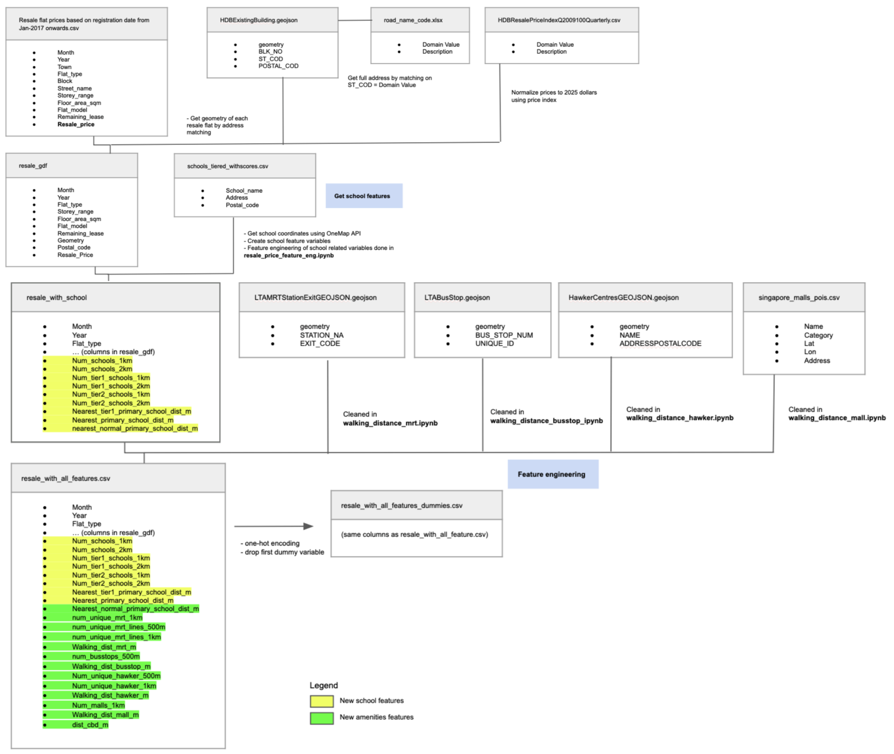

To account for market fluctuations over time, the resale prices were converted to real prices (with 2025 as base year) using the HDB Resale Price Index.

### 3.3 Exploratory Data Analysis  
Tier 1 schools cluster strongly in central and southeast regions, with peripheral towns like Woodlands and Sembawang significantly further from Tier 1 schools than central areas like Bukit Timah and Marine Parade. This spatial concentration suggests proximity to good schools is closely tied to location, introducing potential confounding effects and motivating the use of sequential controls and spatial modelling.

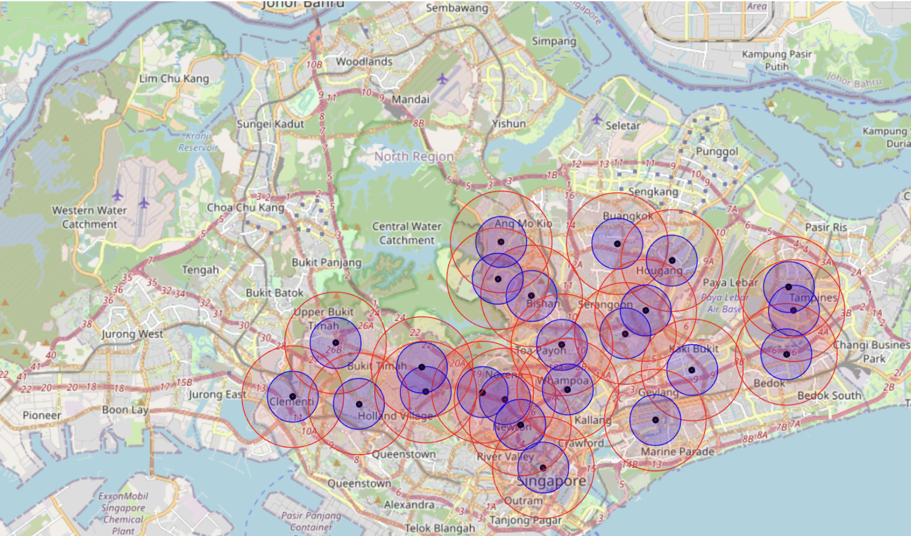
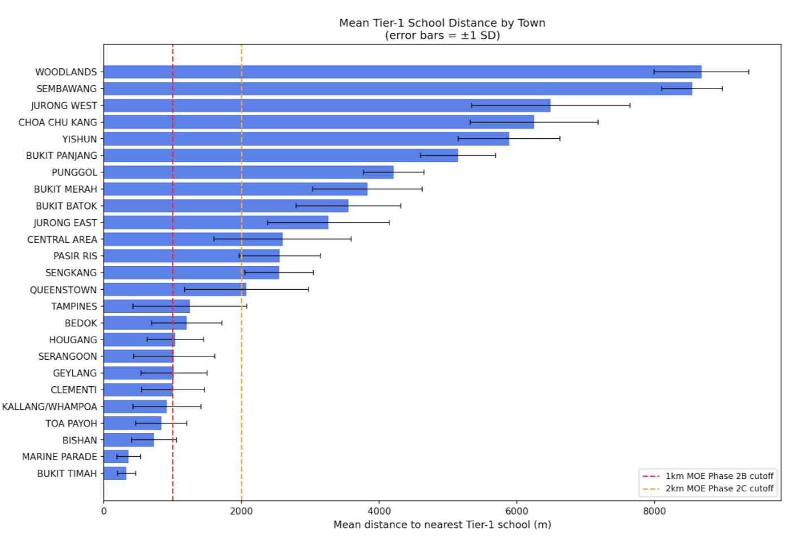

Resale prices are right-skewed in raw form, motivating log transformation in subsequent modelling.

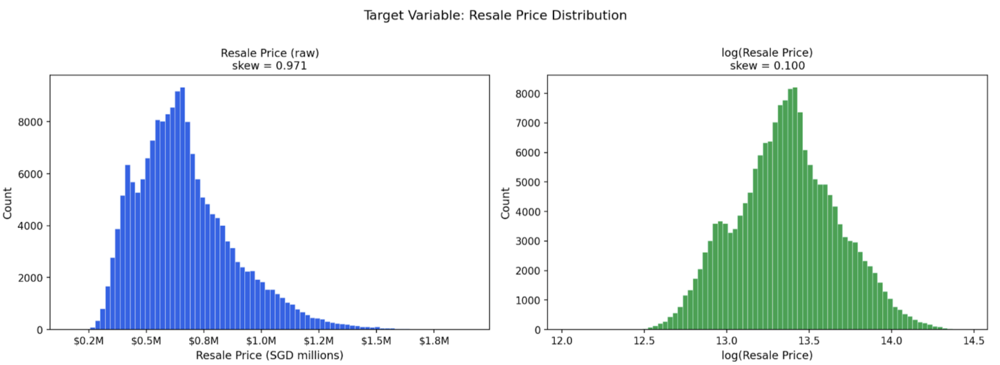

The correlation matrix reveals that variables measuring similar amenities at different distance ranges were excluded to prevent multicollinearity.

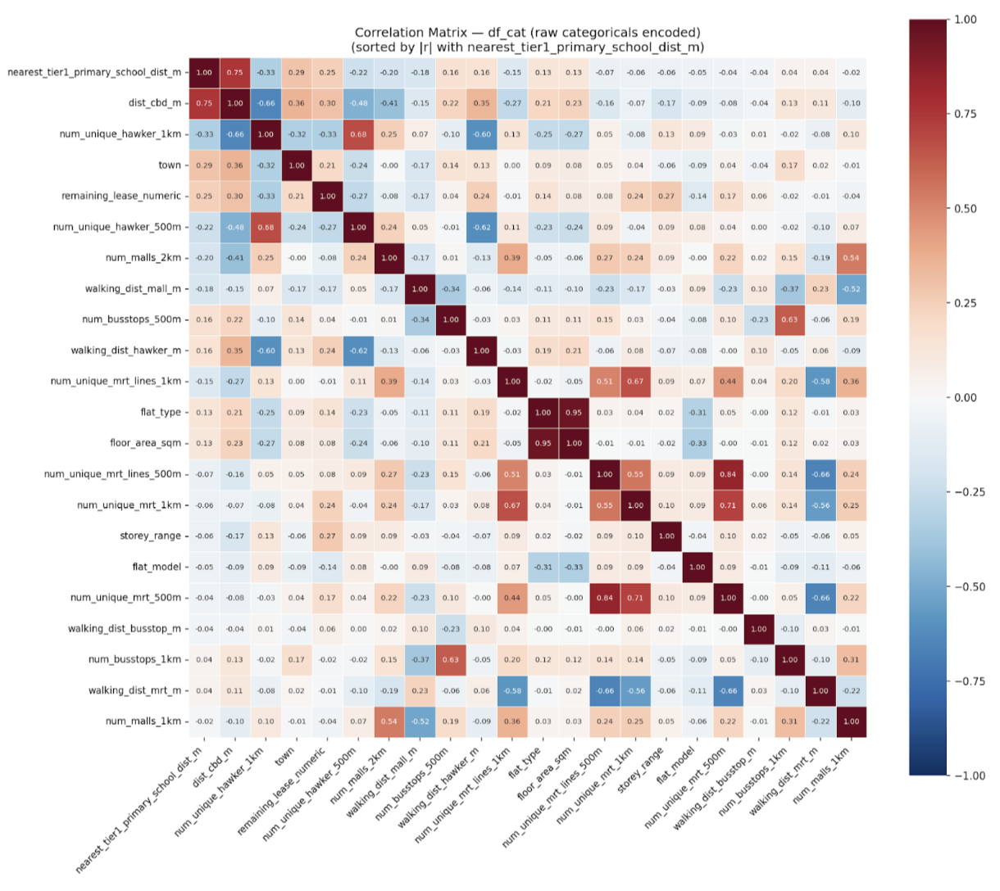

### 3.4 Experimental Design  
To estimate the impact of proximity to “good” schools on HDB resale prices, 3 modelling approaches were used,each addressing a different aspect of the research question:

1. Hedonic Pricing OLS: decomposes resale prices into contributions of individual attributes.   
2. Spatial Error Model (SEM): addresses spatial autocorrelation in OLS residuals. Regression  
3. Discontinuity Design (RDD): exploits Singapore's 1km and 2km school admission priority thresholds as sharp cutoffs, testing for discontinuous jumps in resale prices at each boundary.

#### 3.4.1 Hedonic Pricing OLS Model 

**Methodology**

A hedonic pricing model was estimated using Ordinary Least Squares (OLS) to decompose HDB resale prices into the contributions of individual attributes. The dependent variable is log-transformed resale price, allowing coefficients to be interpreted directly as percentage price effects. Sequential specifications trace how the school proximity coefficient evolves as controls are added and progressively isolate the school-specific premium, assessing sensitivity to omitted variable bias. Five sequential specifications were estimated for both 1km and 2km proximity bands.   
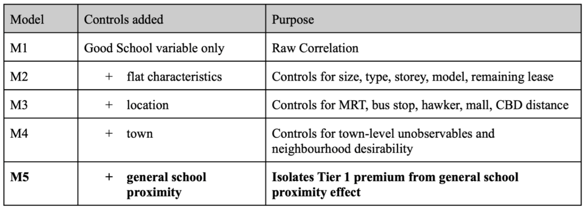

In Model 5, both near good school (*near\_tier1*) and near general school (*near\_schools*) variables are included simultaneously. This allows *near\_schools* to absorb the general effect of any school proximity, including disamenities such as noise and traffic congestion, while *near\_tier1* captures the additional premium specifically attributable to good school quality above and beyond the baseline school effect. Therefore, M5 is referred to as our main model and the coefficient on *near\_tier1* directly reflects the isolated good school premium relative to being near a general school.

**Results & Interpretation**

This table represents OLS coefficient on *near\_tier1* across all five specifications for both the 1km and 2km bands.  
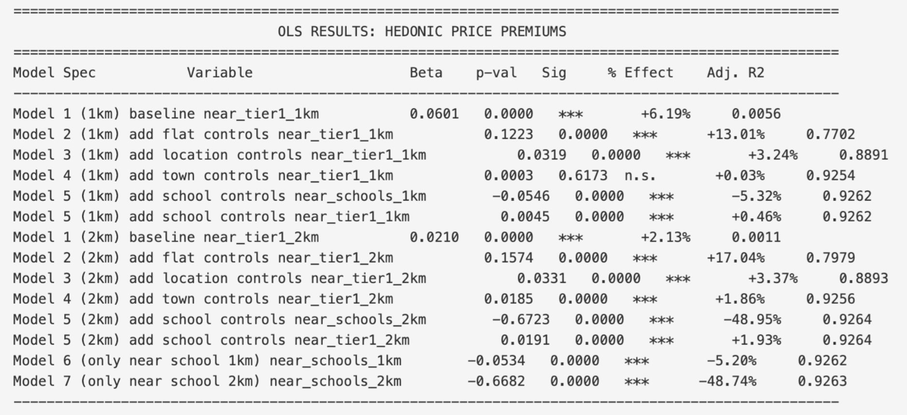

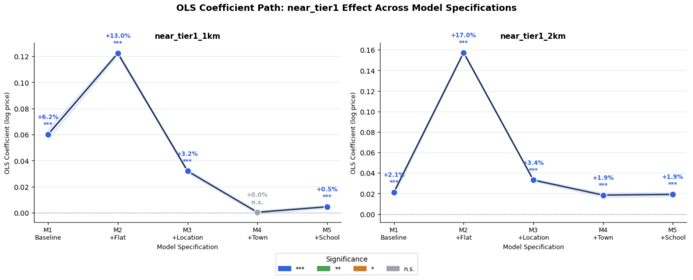

***1km Band***  

The M1 baseline coefficient of \+6.2% represents the raw price difference between flats within 1km of a Tier 1 school and all others, without any controls. The adj. R² of 0.006 confirms that school proximity alone explains almost none of the price variation. Adding flat characteristics in M2 causes the coefficient to increase to \+13.0%, reflecting negative omitted variable bias in M1 where Tier 1 schools are predominantly located in mature estates with older and smaller flats. The sharp rise in adjusted R² from 0.006 to 0.770 confirms that flat characteristics account for the majority of price variation.When location controls are added in M3, the coefficient drops sharply to \+3.2%, revealing that much of the M2 premium was an accessibility premium rather than a school effect where Good Schools happen to be located in areas near MRT, malls, and other amenities.

Most notably, at M4, town fixed effects reduce the coefficient to effectively zero. This indicates that the school premium observed in M1-M3 was also largely a town-level effect. For instance, flats in Bukit Timah command a premium because of Bukit Timah's overall desirability, not because of its proximity to Nanyang Primary School specifically. The two are inseparable at the 1km scale because good schools and expensive neighbourhoods are geographically concentrated in the same areas.

In M5, when *near\_schools\_1km* is introduced alongside *near\_tier1\_1km*, the general school proximity variable enters at \-5.3%. This is consistent with school disamenities including traffic congestion during drop-off and pick-up hours, noise, and increased footfall. Against this disamenity baseline, the Tier 1 coefficient recovers to a small but statistically significant \+0.5%. This means that conditional on being near a school, buyers pay a slight additional premium for Tier 1 quality.

***2km Band***  

2km is the outer boundary for distance-based P1 registration priority. Results for the 2km band follow a similar pattern through M1-M3, with the same mechanisms as the controls are added.

Results follow a similar pattern through M1-M3. Unlike 1km, the Tier 1 coefficient is significant despite town fixed effects at M4 (+1.9%), as a 2km radius frequently spans town boundaries. The coefficient remains stable at \+1.9% in M5. The near\_schools\_2km coefficient of \-48.95% is unreliable due to near-perfect collinearity where most HDB flats have at least one school within 2km and should not be interpreted.

However, OLS does not account for spatial dependence, where nearby properties may influence each other’s prices. Hence, this limitation motivates the use of spatial models below.

#### 3.4.2 Spatial Model   
**Model Justification and Methodology**  

Unobserved neighbourhood factors (eg. estate desirability) create spatial [heterogeneity](https://sites.duke.edu/econhonors/files/2017/04/xu2017.pdf), leading to spatially correlated residuals. This violates OLS assumptions of independent errors and can bias [estimates](https://www.researchgate.net/publication/279905297_Spatial_dependence_in_hedonic_property_models_Do_different_corrections_for_spatial_dependence_result_in_economically_significant_differences_in_estimated_implicit_prices#:~:text=Abstract,be%20pooled%20in%20meta%2Danalysis.). 

We tested for spatial autocorrelation using Moran's I, which ranged from 0.52-0.82 across models, indicating positive spatial dependence. This suggests nearby flats share unobserved price components.  
Robust Lagrange Multiplier tests were then used to select the appropriate model. As the Robust LM-error statistic exceeded the LM-lag statistic, a Spatial Error Model (SEM) was chosen. This aligns with literature, where omitted neighbourhood characteristics drive [spatial](https://www.researchgate.net/publication/273817991_USE_OF_SPATIAL_AUTOCORRELATION_TO_BUILD_REGRESSION_MODELS_OF_TRANSACTION_PRICES) [dependence](https://archiv.ivt.ethz.ch/docs/students/sa307.pdf) in housing prices.

SEM accounts for omitted influences by allowing the error term of a flat’s price (u) to depend on the weighted average of errors from nearby flats (W). The strength of this dependence is captured by spatial parameter ($\lambda$).

SEM is specified as: 

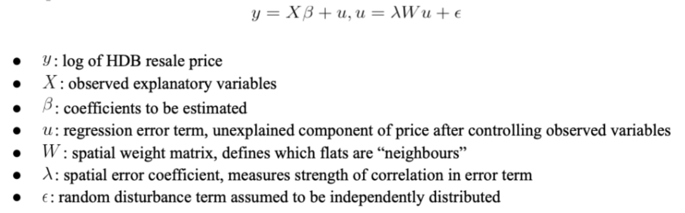

A K-nearest neighbours (KNN) weights matrix is used, linking each flat to its k nearest resale observation to capture spatial correlation in unobserved neighbourhood factors. 

For compatibility with OLS, SEM is estimated using the same five specifications (M1-M5). However, interpretation focuses on the fully specified model (M5), which best isolates spatial dependence.

**Results & Interpretation** 

Despite strong spatial autocorrelation (λ ≈ 0.70–0.86), OLS and SEM coefficients are similar across both bands, suggesting unobserved spatial factors are not strongly correlated with included regressors. At 1km (M5), SEM estimates a general school effect of \-4.9%, reflecting disamenities and a Tier 1 premium of \+0.6%, consistent with OLS, partially offsetting but not reversing these effects. At 2km, the Tier 1 coefficient is \+1.4%.

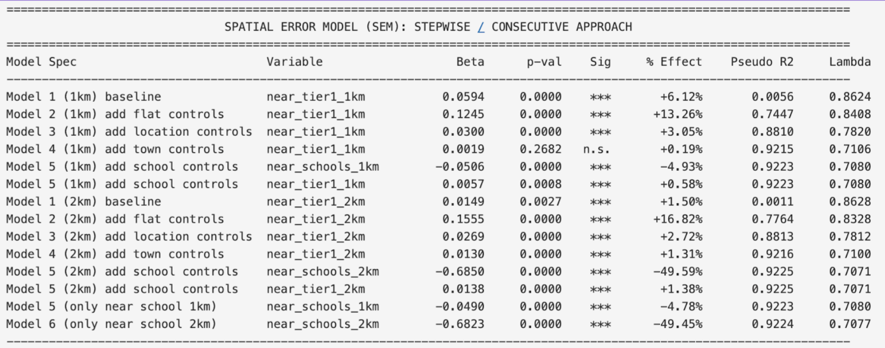  
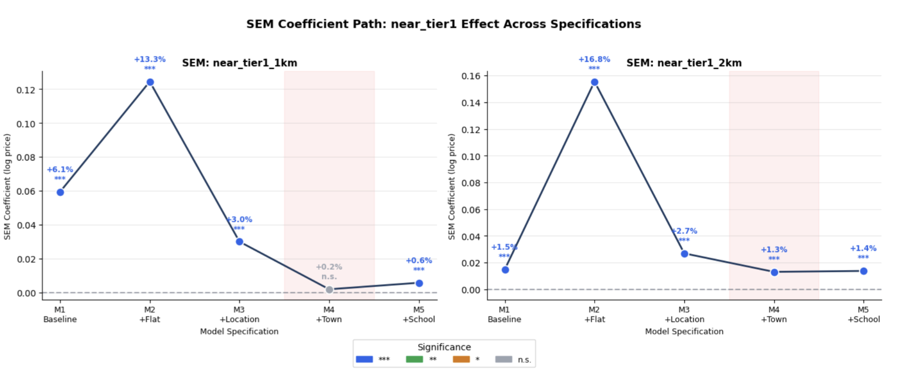  

***Evaluation of Robustness***  

We evaluate robustness using two criterias: coefficient stability and R² movement as controls are added, following the intuition that a robust estimate should be insensitive to the inclusion of additional observables.

**Coefficient stability**

At 1km, the coefficient declines by 92.4% from M1 (+6.2%) to M5 (+0.5%), indicating sensitivity to observed confounders. The estimate is not stable as it changes dramatically as controls are added, suggesting earlier specifications were heavily confounded. At 2km, the coefficient declines by only 9.0% from M1 (+2.1%) to M5 (+1.9%) and remains unchanged between M4 and M5, indicating the estimate is insensitive to additional controls. The similarity between OLS and SEM estimates provides further confirmation that the 2km coefficient is not driven by omitted spatial factors.

**R² Stability**

R² increases substantially from M1 to M5 for both bands, indicating that the included controls explain the large majority of price variation. The large jump at M2 confirms that flat characteristics dominate price variation. The modest incremental gains from M3 onwards suggest that the controls add meaningful but smaller explanatory power. Crucially, the R² at M5 is near-identical across both bands, confirming that the difference in coefficient stability between 1km and 2km is not attributable to differences in model fit. This isolates coefficient stability as the key differentiator between the two bands.

***Overall Results***  

The 2km premium of \+1.9% is robust across specifications, spatial correction and formal omitted variable bias testing, and is consistent with buyers valuing proximity within the P1 registration priority zone. The 1km premium, by contrast, is fully absorbed by town fixed effects and is not robust. This reflects general neighbourhood desirability in areas where good schools cluster rather than school quality. General school proximity carries a mild negative effect at 1km due to disamenities such as traffic congestion, with the net effect of being near a Tier 1 school approximately \-4.5%. Overall, school effects are statistically significant but economically modest relative to structural and locational factors (adj. R² \= 0.925).

#### 3.4.3 Regression Discontinuity Design (RDD) Model   
**Methodology**

The RDD model focuses on flats located close to the threshold and tests whether there is a discontinuous jump of the log resale price of flats at the cutoff. As Singapore’s primary school admissions policy creates a sharp eligibility threshold, where flats within 1km and 2km receive school admission priority, we employ a Sharp RDD for the analysis. 

The formula is given by:
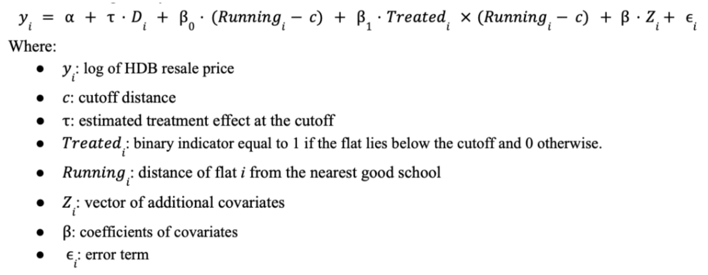

The coefficient τ captures the discontinuous change in resale prices at the cutoff, which represents the estimated price premium associated with good school admission eligibility. To examine the stability of the estimated treatment effect, control variables Zi were added to the model progressively.

**Results and Interpretation**

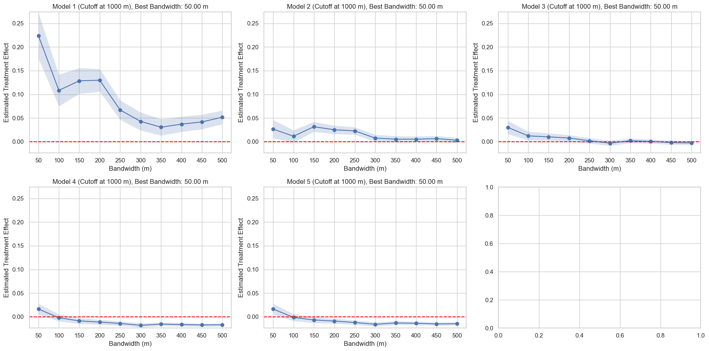  
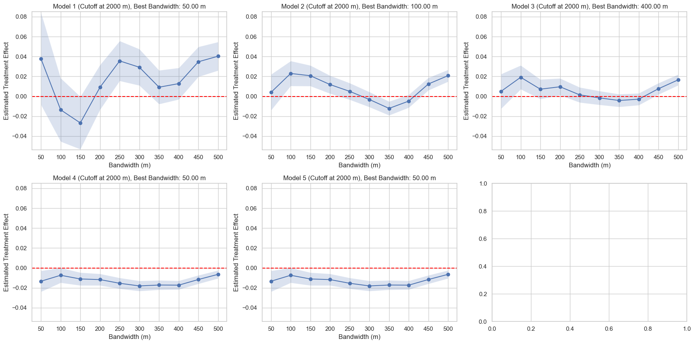 

After progressively adding controls (from Model 1 to Model 5), the treatment coefficient becomes more stable and robust across bandwidths, suggesting that the included control variables account for meaningful sources of variation in housing prices.

* **1km cutoff:** The coefficient is sensitive to bandwidth choice, with the 50m bandwidth indicating positive and significant effects, while bandwidths larger than 150m yield significant negative estimates. This instability raises concerns about the reliability of the estimate at this threshold.  
* **2km cutoff:** The coefficient is considerably more stable across bandwidths and yields statistically significant negative estimates. This implies that flats located just inside the 2 km cutoff are associated with lower prices compared to flats just outside the cutoff, which seems counterintuitive. 

**Validity Tests**   

To access whether the RDD design is valid, we conducted three standard validity checks:   
First, balance tests show many covariates differ significantly across the cutoff, implying flats are not randomly assigned near the threshold, plausibly due to overlapping catchment boundaries. Second, the McCrary density test finds significantly higher flat density just below the 1km cutoff, suggesting potential sorting. Finally, placebo cutoff tests find significant effects at several non-true cutoffs, suggesting prices change at multiple distances. Overall, our validity tests reveal that the core assumptions for RDD analysis are unlikely to hold in this setting. As a result, RDD cannot give a reliable estimate of the causal estimate of the school proximity effect on housing prices. 

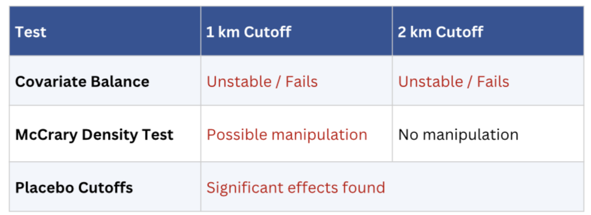  

## Findings

### 4.1 Discussion   
Our results suggest that proximity to a good primary school is associated with a small but statistically significant price premium in the HDB resale market. Flats within 1km are priced about 0.45% higher in the hedonic model and 0.57% higher in the spatial model, while those within 2km see increases of 1.91% and 1.38% respectively. For homebuyers, property analysts and policymakers, this suggests that school quality is positively valued, although the magnitude of the premium is relatively modest. 

Returning to the success criteria defined earlier, the analysis successfully distinguishes the Tier 1 school premium from general school proximity effects across two modelling approaches with adj. R² of 0.925, meeting the primary business goal.

The hedonic and spatial regression models are interpretable and deployable, allowing stakeholders to understand how different housing attributes contribute to property values. However, fairness considerations remain important, as price premiums linked to school quality may reflect broader inequalities in access to desirable neighbourhoods and educational resources. Households with greater financial resources may be better able to purchase homes near high-performing schools, potentially reinforcing socioeconomic segregation across neighbourhoods. Therefore, while the housing market capitalises the value of school quality into property prices, policymakers should be aware that such dynamics may amplify existing inequalities in access to education and housing.

### 4.2 Recommendations
Based on the findings, we recommend proceeding with a limited deployment of the school proximity features into MND's existing forecasting model as a supplementary input, pending validation on more recent transaction data.

From a policy perspective, concentration of demand around a small number of good schools may reinforce uneven housing demand across neighbourhoods, supporting efforts to reduce perceived disparities in school quality and improve accessibility across estates. Integrating housing, transport and education planning would help moderate school premiums and promote a more equitable landscape.

We recommend incorporating good school proximity variables as supplementary features in MND's existing resale price forecasting pipeline. Integration costs are low and no new data infrastructure is required. Given the modest magnitude of the school effect relative to structural factors, variables should be treated as supplementary predictors.

